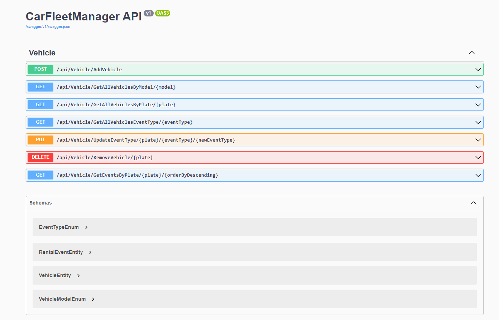

# CarFleetManager



## Installation and Setup

Before you start, make sure you have the following tools installed:

- Visual Studio
- .NET Core SDK
- ASP.NET Core Web App

Once you have the necessary tools, follow these steps to start working with the project:

1. **Clone the Repository:**
   - Use `git clone` to clone the repository to your local machine.

2. **Open the Project in Visual Studio:**
   - Launch Visual Studio.
   - Open the project by selecting the solution file.

3. **Run the Project:**
   - Build and run the WebApi project.

4. **Installing Dependencies:**
   - The project relies on Dapper and XUnit.
   - Open the project in Visual Studio.
   - In the Solution Explorer, right-click on the project and select "Manage NuGet Packages."
   - In the Manage NuGet Packages dialog, search for "Dapper" and "XUnit."
   - Select the packages and click on the Install button to install the dependencies.

## Changing Database Configuration

In the WebApi project, navigate to the appsettings.json file, and update the ConnectionStrings section with your desired database configuration.

## Database Setup

The project uses a SQL Server database with two tables: `Vehicle` and `RentalEvent`. Here are the SQL scripts to create tables and insert sample data:

```sql
-- Create Vehicle table
CREATE TABLE Vehicle
(
    Plate NVARCHAR(7) PRIMARY KEY,
    Model INT CHECK (Model IN (11, 22, 33)) NOT NULL,
    RegistrationDate DATETIME NOT NULL
);

-- Create RentalEvents table with VehicleId as a foreign key
CREATE TABLE RentalEvent
(
    Id INT IDENTITY(1,1) PRIMARY KEY,
    VehiclePlate NVARCHAR(7) NOT NULL,
    EventType INT CHECK (EventType IN (1, 2, 3)) NOT NULL,
    EventDate DATETIME NOT NULL, 
    FOREIGN KEY (VehiclePlate) REFERENCES Vehicle(Plate)
);

-- Insert data into Vehicle table
INSERT INTO Vehicle (Plate, Model, RegistrationDate)
VALUES
    ('RIO2A18', 11, '2023-05-05T10:00:00'),
    ('ARG2B19', 22, '2024-05-06T12:30:00'),
    ('BRA2C20', 33, '2024-10-07T15:45:00');

-- Insert data into RentalEvent table
INSERT INTO RentalEvent (VehiclePlate, EventType, EventDate)
VALUES
    ((SELECT Plate FROM Vehicle WHERE Plate = 'RIO2A18'), 1, '2023-10-05T10:15:00'),
    ((SELECT Plate FROM Vehicle WHERE Plate = 'ARG2B19'), 2, '2023-10-06T13:00:00'),
    ((SELECT Plate FROM Vehicle WHERE Plate = 'BRA2C20'), 3, '2023-10-07T16:00:00');

-- Insert more data into RentalEvent table for the same vehicles
INSERT INTO RentalEvent (VehiclePlate, EventType, EventDate)
VALUES
    ((SELECT Plate FROM Vehicle WHERE Plate = 'RIO2A18'), 2, '2023-10-14T08:00:00'),
    ((SELECT Plate FROM Vehicle WHERE Plate = 'ARG2B19'), 1, '2023-10-15T12:30:00'),
    ((SELECT Plate FROM Vehicle WHERE Plate = 'BRA2C20'), 3, '2023-10-16T15:00:00');

-- Insert additional data into RentalEvent table for the same vehicles
INSERT INTO RentalEvent (VehiclePlate, EventType, EventDate)
VALUES
    ((SELECT Plate FROM Vehicle WHERE Plate = 'BRA2C20'), 3, '2023-10-19T18:00:00');

-- Query to retrieve data from both tables
SELECT
    V.*,
    R.*
FROM
    Vehicle V
INNER JOIN
    RentalEvent R ON V.Plate = R.VehiclePlate; 

